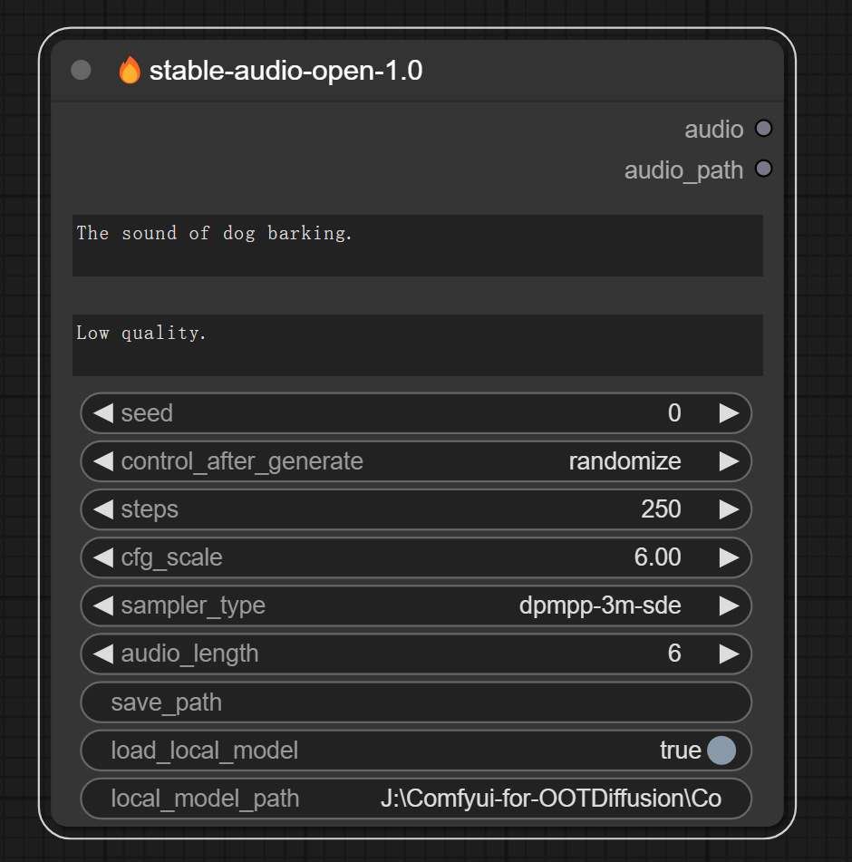
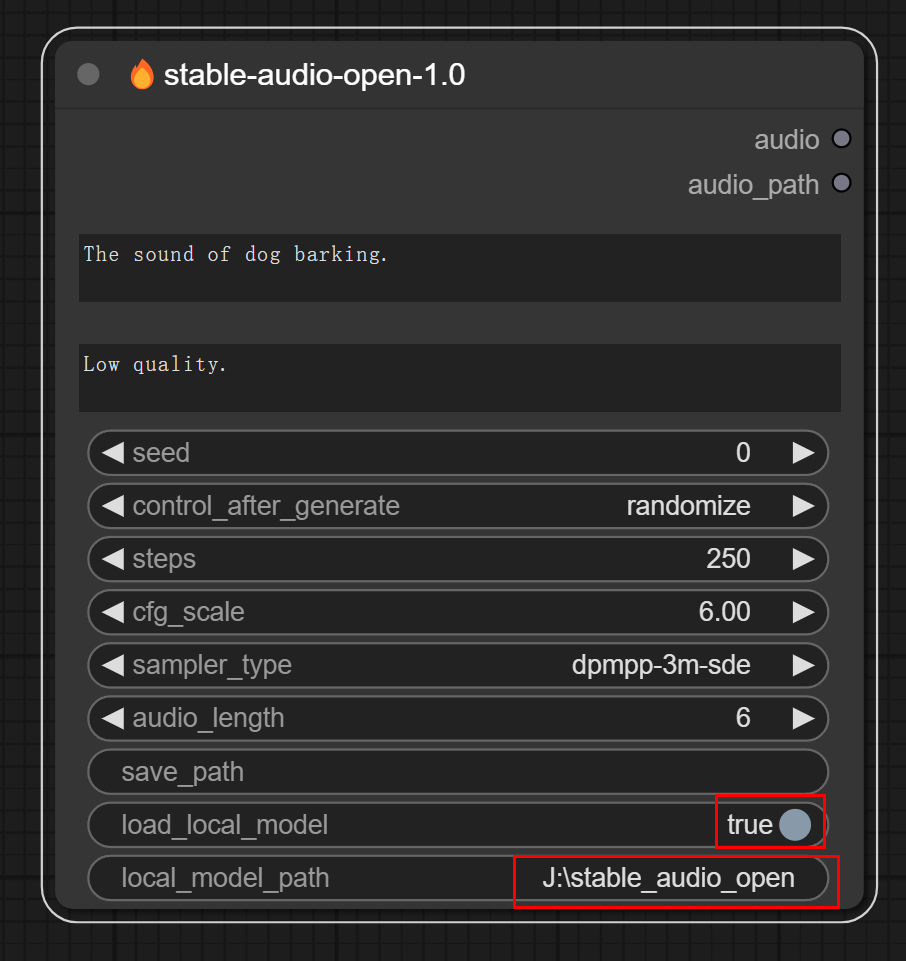
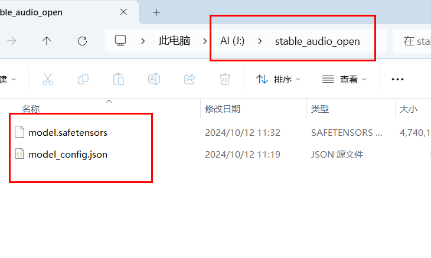

<h1 align="center">ComfyUI-StableAudioOpen</h1>

      English | <a href="README.md">中文</a>

## Introduction

The implementation of the audio generation model **stable-audio-open** in ComfyUI enables ComfyUI to achieve text-to-audio functionality.。 

## Installation 

#### Method 1:

1. Go to comfyUI custom_nodes folder, `ComfyUI/custom_nodes/`
2. `git clone https://github.com/MoonHugo/ComfyUI-StableAudioOpen.git`
3. `cd ComfyUI-StableAudioOpen`
4. `pip install -r requirements.txt`
5. restart ComfyUI.

#### Method 2:
Directly download the node source package, then extract it into the custom_nodes directory, and finally restart ComfyUI.

#### Method 3：
Install through ComfyUI-Manager by searching for 'ComfyUI-StableAudioOpen' and installing it.

## Usage

###### Parameter Description
**prompt**: Positive prompt words, such as:`The sound of dog barking.` 
**negative_prompt**: Negative prompt words, such as:`Low quality.` 
**seed**: Integer type, used to set the seed value to ensure the reproducibility of results, with a value range between 0 and 0xffffffffffffffff. 
**control_after_generate**: There are four modes for changing the seed: fixed, increment, decrement, and randomize. 
**steps**: The number of steps to generate audio, for example: ` 250` 
**cfg_scale**: The value range is from 0 to 10, with a default value of 6. The higher the value, the more closely the generated content typically adheres to the given description, but it may come at the expense of some creativity. 
**sampler_type**: Sampler types include six options: dpmpp-3m-sde, dpmpp-2m-sde, k-heun, k-dpmpp-2s-ancestral, k-dpm-2, and k-dpm-fast. 
**audio_length**: Sets the length of the generated audio, in seconds, with a maximum of 47 seconds. 
**save_path**: Set the path for saving the audio, for example: `C:\Users\Desktop\`. If left empty, the audio will be saved by default in `ComfyUI\output\stable-audio-open-1.0`. 
**load_local_model**: Load local model, with the default value set to False. 
**local_model_path**: To load the local model, you need to set load_local_model to True and specify the local_model_path as the path where the local model is located. For example: J:\stable_audio_open，As shown in the figure below.

**Model download URL** [https://huggingface.co/stabilityai/stable-audio-open-1.0](https://huggingface.co/stabilityai/stable-audio-open-1.0)

## Social Account Homepage
- Bilibili：[My BILIBILI Homepage](https://space.bilibili.com/1303099255)

## Acknowledgments

Thanks to stabilityai/stable-audio-open-1.0 repo owner [stabilityai/stable-audio-open-1.0](https://huggingface.co/stabilityai/stable-audio-open-1.0)

## star history

